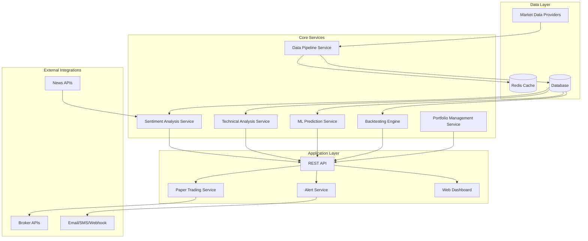

# Sliced Bread Design Document

## Overview

Sliced Bread is designed as a modular, scalable AI-powered stock analysis and trading system. The architecture follows a microservices approach with clear separation of concerns, enabling independent scaling and maintenance of different components. The system is built to evolve from basic backtesting capabilities to a full-featured platform with real-time analysis, ML-driven insights, and automated trading.

The design prioritizes reliability, explainability, and regulatory compliance while maintaining high performance for real-time market analysis. The system uses a layered architecture with data ingestion at the base, processing and analysis in the middle, and user interfaces and external integrations at the top.

## Architecture

### High-Level Architecture



### Technology Stack

- **Backend**: Python with FastAPI for REST services
- **Database**: PostgreSQL for production, SQLite for development
- **Cache**: Redis for real-time data and session management
- **ML Framework**: XGBoost for predictions, scikit-learn for preprocessing
- **Backtesting**: Backtrader framework
- **Frontend**: React with TypeScript for the web dashboard
- **Containerization**: Docker with Docker Compose for development
- **Message Queue**: Celery with Redis for background tasks
- **Monitoring**: Prometheus and Grafana for system metrics

## Components and Interfaces

### Data Pipeline Service

**Purpose**: Manages all market data ingestion, validation, and storage operations.

**Key Responsibilities**:
- Fetch data from multiple providers (yfinance, Alpha Vantage, etc.)
- Validate and clean incoming data
- Handle data provider failover and redundancy
- Manage data refresh schedules and caching strategies

**Interface**:
```python
class DataPipelineService:
    def fetch_ohlc_data(self, symbol: str, start_date: date, end_date: date) -> DataFrame
    def get_real_time_quote(self, symbol: str) -> Quote
    def refresh_data(self, symbols: List[str]) -> RefreshStatus
    def validate_data_quality(self, data: DataFrame) -> DataQualityReport
```

**Design Rationale**: Centralized data management ensures consistency and enables efficient caching. The service abstracts data provider differences and provides a unified interface for all market data needs.

### Backtesting Engine

**Purpose**: Executes trading strategies against historical data using the Backtrader framework.

**Key Responsibilities**:
- Strategy execution with realistic transaction costs
- Performance metric calculation (P&L, Sharpe ratio, drawdown)
- Comparative analysis across multiple strategies
- Data gap handling and quality reporting

**Interface**:
```python
class BacktestEngine:
    def run_backtest(self, strategy: Strategy, data: DataFrame, config: BacktestConfig) -> BacktestResult
    def compare_strategies(self, strategies: List[Strategy], data: DataFrame) -> ComparisonReport
    def calculate_metrics(self, trades: List[Trade]) -> PerformanceMetrics
```

**Design Rationale**: Using Backtrader provides battle-tested backtesting capabilities while our wrapper adds enterprise features like comparative analysis and robust error handling.

### ML Prediction Service

**Purpose**: Provides machine learning-based return predictions with uncertainty quantification.

**Key Responsibilities**:
- Feature engineering from market data and technical indicators
- Model training with cross-validation
- Prediction generation with confidence intervals
- Automated model retraining based on performance degradation

**Interface**:
```python
class MLPredictionService:
    def train_model(self, features: DataFrame, targets: Series) -> ModelTrainingResult
    def predict_returns(self, features: DataFrame) -> PredictionResult
    def evaluate_model_performance(self) -> ModelPerformanceReport
    def retrain_if_needed(self) -> RetrainingStatus
```

**Design Rationale**: XGBoost is chosen for its excellent performance on tabular financial data. The service includes automated retraining to handle concept drift in financial markets.

### Technical Analysis Service

**Purpose**: Generates trading signals using technical indicators and pattern recognition.

**Key Responsibilities**:
- Calculate standard technical indicators (SMA, RSI, MACD, Bollinger Bands)
- Generate buy/sell signals with confidence scoring
- Combine multiple indicators with weighted scoring
- Adaptive parameter adjustment based on market conditions

**Interface**:
```python
class TechnicalAnalysisService:
    def calculate_indicators(self, data: DataFrame, indicators: List[str]) -> DataFrame
    def generate_signals(self, data: DataFrame, strategy_config: Dict) -> SignalResult
    def combine_signals(self, signals: List[Signal]) -> CompositeSignal
```

**Design Rationale**: Modular indicator calculation allows for easy addition of new indicators. The weighted signal combination provides flexibility in strategy development.

### Sentiment Analysis Service

**Purpose**: Analyzes news sentiment and incorporates it into trading decisions.

**Key Responsibilities**:
- Fetch news from multiple sources (NewsAPI, etc.)
- Perform sentiment analysis using VADER with financial context
- Normalize and weight sentiment scores
- Create composite signals combining sentiment with technical analysis

**Interface**:
```python
class SentimentAnalysisService:
    def fetch_news(self, symbol: str, lookback_hours: int) -> List[NewsArticle]
    def analyze_sentiment(self, articles: List[NewsArticle]) -> SentimentScore
    def create_composite_signal(self, sentiment: SentimentScore, technical_signal: Signal) -> CompositeSignal
```

**Design Rationale**: VADER is chosen for its effectiveness on financial text. The service provides fallback mechanisms when news data is unavailable.

### Portfolio Management Service

**Purpose**: Handles portfolio optimization, risk management, and position sizing.

**Key Responsibilities**:
- Portfolio optimization using risk-parity and constraint-based approaches
- Position sizing based on correlation analysis and risk budgets
- Rebalancing recommendations
- Risk monitoring and alerting

**Interface**:
```python
class PortfolioService:
    def optimize_portfolio(self, assets: List[str], constraints: Dict) -> OptimizationResult
    def calculate_position_sizes(self, signals: List[Signal], portfolio_value: float) -> Dict[str, float]
    def generate_rebalancing_trades(self, current_portfolio: Portfolio, target_portfolio: Portfolio) -> List[Trade]
    def monitor_risk(self, portfolio: Portfolio) -> RiskReport
```

**Design Rationale**: The service supports multiple optimization approaches to handle different market conditions and user preferences. Risk monitoring is integrated to ensure compliance with risk limits.

### Alert Service

**Purpose**: Manages real-time notifications and system health monitoring.

**Key Responsibilities**:
- Send trading signal alerts via email, SMS, and webhooks
- Monitor system component health and performance
- Manage alert preferences and delivery channels
- Implement retry logic with exponential backoff for failed deliveries

**Interface**:
```python
class AlertService:
    def send_trading_alert(self, signal: Signal, recipients: List[str]) -> AlertStatus
    def send_system_alert(self, component: str, status: SystemStatus) -> AlertStatus
    def configure_alert_preferences(self, user_id: str, preferences: AlertPreferences) -> None
    def get_alert_history(self, user_id: str, timeframe: timedelta) -> List[Alert]
```

**Design Rationale**: Centralized alert management ensures consistent delivery across all notification channels. The service includes robust retry mechanisms and preference management for different user types.

### Alternative Data Service

**Purpose**: Integrates alternative data sources like insider trading and social media sentiment.

**Key Responsibilities**:
- Fetch and normalize insider trading data
- Analyze social media sentiment from financial discussions
- Weight alternative data based on recency and reliability
- Create composite signals combining traditional and alternative data

**Interface**:
```python
class AlternativeDataService:
    def fetch_insider_trading_data(self, symbol: str) -> List[InsiderTrade]
    def analyze_social_sentiment(self, symbol: str, platforms: List[str]) -> SocialSentiment
    def create_alternative_signal(self, symbol: str, data_sources: List[str]) -> AlternativeSignal
    def validate_data_freshness(self, data_source: str) -> DataFreshnessReport
```

**Design Rationale**: Alternative data provides additional market insights but requires careful validation and weighting. The service includes data quality checks and graceful degradation when sources are unavailable.

### Model Explainability Service

**Purpose**: Provides interpretable explanations for ML model predictions and trading decisions.

**Key Responsibilities**:
- Generate SHAP and LIME explanations for ML predictions
- Create decision audit trails for regulatory compliance
- Monitor model behavior changes over time
- Flag decisions requiring manual review

**Interface**:
```python
class ExplainabilityService:
    def explain_prediction(self, model: MLModel, features: DataFrame) -> Explanation
    def create_decision_audit(self, trade: Trade, contributing_factors: Dict) -> AuditTrail
    def monitor_model_drift(self, model: MLModel, recent_predictions: List) -> DriftReport
    def flag_for_review(self, decision: TradingDecision, confidence_threshold: float) -> ReviewFlag
```

**Design Rationale**: Explainability is crucial for regulatory compliance and user trust. The service provides multiple explanation methods and maintains comprehensive audit trails for all trading decisions.

## Data Models

### Core Data Models

```python
@dataclass
class Quote:
    symbol: str
    timestamp: datetime
    open: float
    high: float
    low: float
    close: float
    volume: int
    adjusted_close: Optional[float] = None

@dataclass
class Signal:
    symbol: str
    timestamp: datetime
    signal_type: SignalType  # BUY, SELL, HOLD
    strength: float  # 0.0 to 1.0
    confidence: float  # 0.0 to 1.0
    source: str  # technical, ml, sentiment, composite
    metadata: Dict[str, Any]

@dataclass
class Trade:
    symbol: str
    timestamp: datetime
    action: TradeAction  # BUY, SELL
    quantity: int
    price: float
    commission: float
    strategy_id: str

@dataclass
class Portfolio:
    positions: Dict[str, Position]
    cash: float
    total_value: float
    last_updated: datetime

@dataclass
class BacktestResult:
    strategy_id: str
    start_date: date
    end_date: date
    initial_capital: float
    final_value: float
    total_return: float
    sharpe_ratio: float
    max_drawdown: float
    trades: List[Trade]
    daily_returns: Series
```

### Database Schema Design

The system uses a normalized database schema with the following key tables:

- `market_data`: OHLC data with proper indexing on symbol and timestamp
- `signals`: Generated trading signals with metadata
- `trades`: Executed trades for backtesting and paper trading
- `portfolios`: Portfolio snapshots and positions
- `strategies`: Strategy configurations and parameters
- `model_predictions`: ML model outputs with confidence intervals
- `news_articles`: Cached news data with sentiment scores

**Design Rationale**: The schema is optimized for time-series queries with appropriate indexing. Separate tables for different data types enable efficient querying and maintenance.

## Error Handling

### Error Handling Strategy

The system implements a comprehensive error handling strategy with the following principles:

1. **Graceful Degradation**: When external services fail, the system continues operating with cached data or reduced functionality
2. **Circuit Breaker Pattern**: Prevents cascading failures by temporarily disabling failing services
3. **Retry Logic**: Implements exponential backoff for transient failures
4. **Comprehensive Logging**: All errors are logged with context for debugging and monitoring

### Error Categories and Responses

```python
class ErrorHandler:
    def handle_data_provider_error(self, error: DataProviderError) -> ErrorResponse:
        # Fallback to cached data, log error, notify administrators
        
    def handle_ml_model_error(self, error: MLModelError) -> ErrorResponse:
        # Fall back to technical analysis only, schedule model retraining
        
    def handle_broker_api_error(self, error: BrokerAPIError) -> ErrorResponse:
        # Queue trades for retry, alert users, switch to simulation mode
        
    def handle_database_error(self, error: DatabaseError) -> ErrorResponse:
        # Use read replicas, cache responses, alert administrators
```

**Design Rationale**: The error handling system prioritizes system availability over perfect accuracy. Users are always informed of degraded functionality, and automatic recovery mechanisms are in place.

## Testing Strategy

### Testing Pyramid

1. **Unit Tests**: Comprehensive coverage of individual components
   - Data validation and transformation logic
   - Technical indicator calculations
   - ML model training and prediction logic
   - Portfolio optimization algorithms

2. **Integration Tests**: Service interaction testing
   - Data pipeline end-to-end flows
   - API endpoint functionality
   - Database operations and transactions
   - External service integrations

3. **System Tests**: Full system behavior validation
   - Complete backtesting workflows
   - Real-time data processing pipelines
   - User interface functionality
   - Performance and load testing

### Test Data Strategy

- **Historical Market Data**: Curated datasets for consistent backtesting
- **Synthetic Data**: Generated data for edge case testing
- **Mock Services**: Simulated external APIs for reliable testing
- **Performance Benchmarks**: Standardized datasets for performance regression testing

### Continuous Testing

- **Automated Test Execution**: All tests run on every commit
- **Performance Monitoring**: Automated performance regression detection
- **Data Quality Tests**: Continuous validation of incoming market data
- **Model Performance Tests**: Automated monitoring of ML model accuracy

**Design Rationale**: The testing strategy ensures reliability while enabling rapid development. Automated testing catches regressions early, and performance monitoring ensures the system scales appropriately.

## Security and Compliance

### Security Measures

- **API Authentication**: JWT-based authentication for all API endpoints
- **Data Encryption**: Encryption at rest and in transit for sensitive data
- **Access Control**: Role-based access control for different user types
- **Audit Logging**: Comprehensive logging of all trading decisions and user actions

### Compliance Features

- **Decision Audit Trails**: Complete traceability of all trading decisions
- **Model Explainability**: SHAP/LIME explanations for all ML predictions
- **Risk Monitoring**: Real-time monitoring of portfolio risk metrics
- **Regulatory Reporting**: Automated generation of compliance reports

**Design Rationale**: Security and compliance are built into the system from the ground up, ensuring the system can be used in regulated environments while maintaining user trust.

## Deployment and Scalability

### Containerization Strategy

- **Microservices Architecture**: Each service runs in its own container
- **Docker Compose**: Development environment orchestration
- **Kubernetes**: Production deployment and scaling
- **Health Checks**: Comprehensive health monitoring for all services

### Scaling Considerations

- **Horizontal Scaling**: Services can be scaled independently based on load
- **Database Sharding**: Market data can be partitioned by symbol or time
- **Caching Strategy**: Multi-level caching for frequently accessed data
- **Load Balancing**: Intelligent routing based on service health and load

### CI/CD Pipeline

- **Automated Testing**: Full test suite execution on every commit
- **Staged Deployment**: Development → Staging → Production pipeline
- **Blue-Green Deployment**: Zero-downtime production deployments
- **Rollback Capability**: Automatic rollback on deployment failures

**Design Rationale**: The deployment strategy prioritizes reliability and enables rapid iteration. The containerized architecture allows for efficient resource utilization and easy scaling.